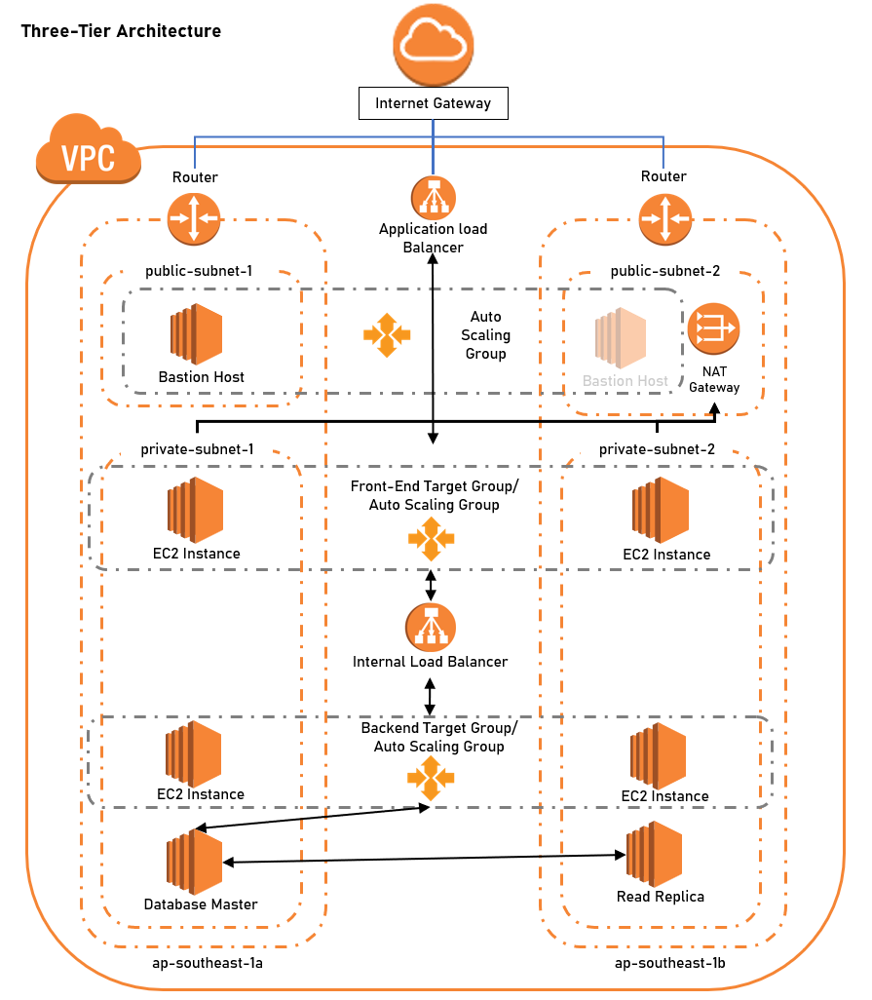

# Three-Tier Infrastructure Setup
In this lab, learn to setup a highly redundant three-tier web application cloud infrastructure.

## Architecture 

  

## Lab

| Phases           | Description    | 
| ---------------  | -------------- | 
| [Lab 1](Lab%201) | VPC & Subnets  | 
| [Lab 2](Lab%202) | Bastion Host   | 
| [Lab 3](Lab%203) | Front-End Tier | 