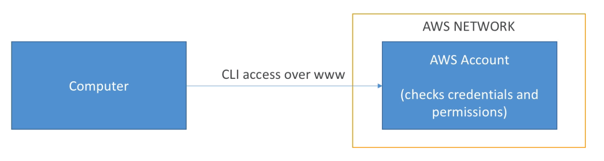

# AWS CLI - Command Line Interface

#### Interact with AWS Proprietary Services (S3, Dynamo DB, etc..) using:

1) CLI on Local Computer\
Setup Reference: [Link](https://docs.aws.amazon.com/cli/latest/userguide/install-cliv2.html)\
2) CLI on EC2 Machines\
Already Available for use\
3) AWS SDK on Local Computer\
4) AWS SDK on EC2 Machines\
5) AWS Instance Metadata on EC2

##### Best Practices
Give permission through assigning IAM Roles to EC2 Instances instead of configuring with secret access key and id

## AWS CLI Configuration (CLI on local computer)
Configure CLI using Access Key to access your AWS account through the web. By using Access key, the user's permission are delegated to your CLI.

  

#### To Acquire Access Key ID & Secret Access key:
- IAM > Users > Select User > Security Credentials > Create Access Key

#### To configure AWS CLI to connect to your account, in your CLI:
1) Execute "aws configure"\
2) Specify Access Key ID / Secret Access Key / Default Region\
3) Verify configuration with ls ~/.aws, you should see "config" and "credentials"

## AWS CLI Commands Reference
AWS documentaries for CLI Commands

Reference Site: [Link](https://docs.aws.amazon.com/cli/latest/index.html)

#### Dry Run
Specify **--dry-run** in your command if you wish to test out a command without it really executing

#### Decode Authorization Messages
For determining what is preventing access, you can decode the authorization message

Reference Site: [Link](https://docs.aws.amazon.com/cli/latest/reference/sts/decode-authorization-message.html)

#### Profiles
Command to configure profile for storing access key details of other accounts:
- **aws configure --profile <other-aws-account>**

Run command with another account's permission:
- **<command> --profile <other-aws-account>**

